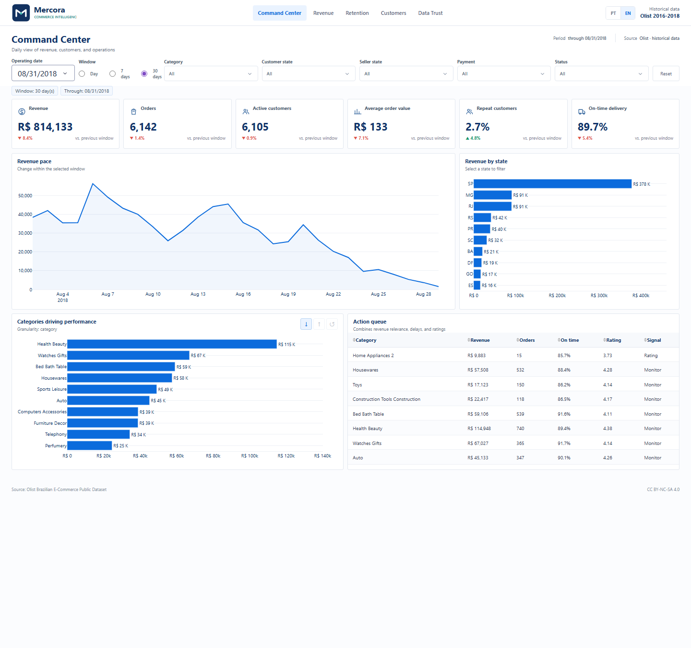
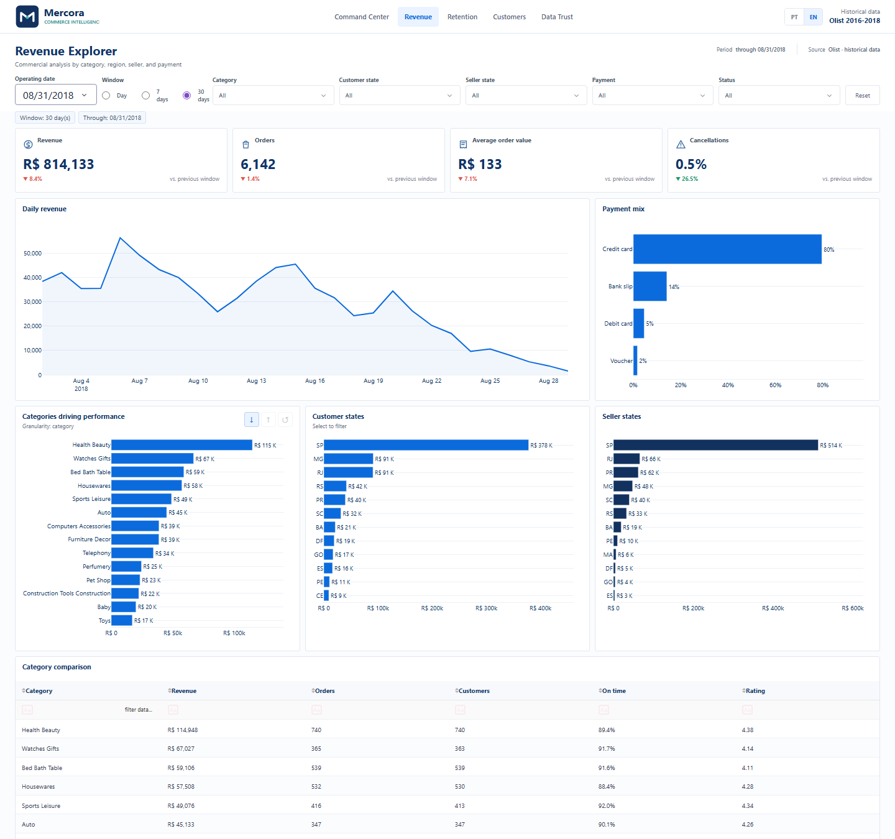
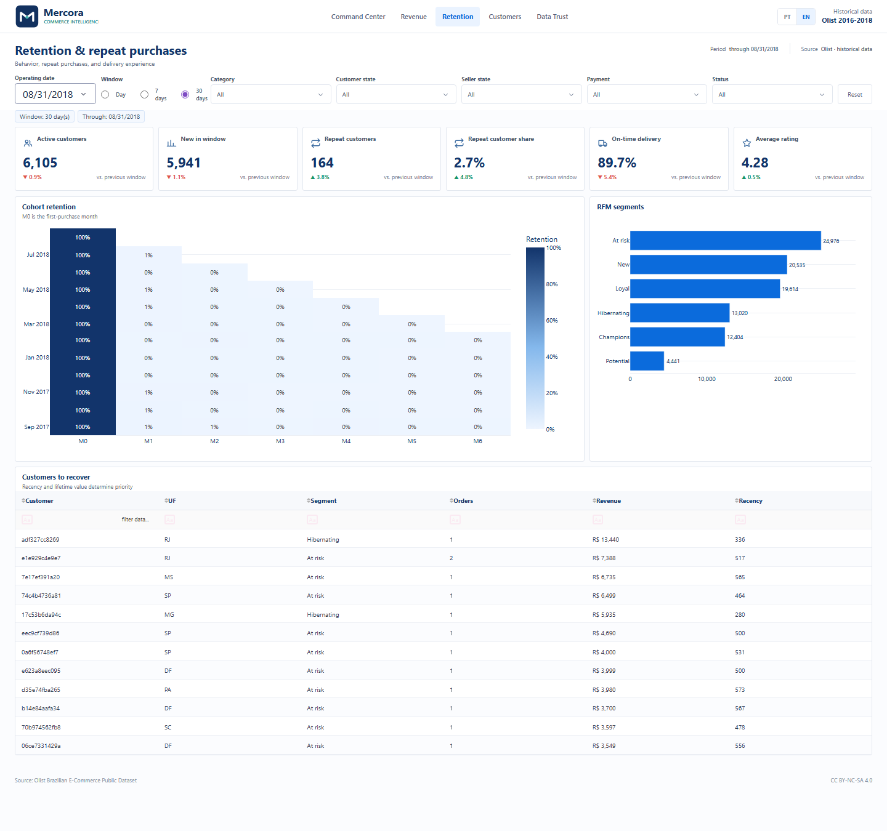
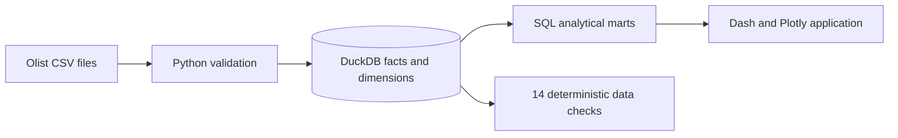

<p align="center">
  
</p>

<h1 align="center">Mercora Commerce Intelligence</h1>

<p align="center">
  A decision-focused commerce analytics product for revenue, retention, delivery, and data trust.
</p>

<p align="center">
  <a href="https://ba9ba428-78e2-4e6e-ac79-8a6dfe44fc99.plotly.app/"><strong>Open live application</strong></a>
  · <a href="README.pt.md">Português</a>
  · <a href="docs/DEMO_GUIDE.md">90-second demo guide</a>
</p>

<p align="center">
  
  
  
  
  
</p>



## The business challenge

Commerce leaders need to know **what changed, who or what caused it, and where to act next**. Raw order files make that difficult because revenue, payments, delivery events, reviews, and customers exist at different grains.

Mercora turns the anonymized Olist dataset into a daily decision product that answers:

- Which categories, sellers, and regions are driving revenue?
- Is weak delivery performance damaging customer experience?
- Which customer groups should be prioritized for recovery?
- Can users trust the numbers and trace how each metric is calculated?

## What the analysis found

| Finding | Business implication |
|---|---|
| On-time orders average **4.29 stars**, versus **2.57** for delayed orders | Prioritize high-revenue categories with declining on-time delivery before increasing acquisition spend |
| Only **3.04%** of customers purchased more than once | Build post-purchase journeys between 30 and 75 days after delivery |
| São Paulo generated **R$ 5.20M** in historical item revenue | Compare regions by efficiency and experience, not revenue volume alone |
| Five categories lead the revenue mix | Give these categories dedicated delivery, rating, and repurchase monitoring |

The findings are reproducible from the project snapshot and are not hardcoded dashboard text. See the complete [analysis and recommendations](docs/INSIGHTS.md).

## Decision workflow

The five workspaces follow a deliberate path from situation to action:

1. **Command Center** identifies deviations and priorities.
2. **Revenue Explorer** locates category, geography, seller, and payment drivers.
3. **Retention** separates acquisition from repeat behavior using cohorts and RFM.
4. **Customer Explorer** reaches anonymous customer and order detail.
5. **Data Trust** exposes lineage, grain, reconciliation, and metric definitions.

<p align="center">
  
  
</p>

## Architecture and modeling



Orders, items, and payments remain separate facts. Item revenue is aggregated before one-to-many joins, preventing installments or multi-item orders from multiplying revenue.

**Snapshot coverage:** 99,441 orders, 96,096 anonymized customers, and 112,650 order items from 2016-2018. The application always labels these dates as historical.

## Engineering evidence

- Reproducible `download -> build -> validate -> serve` pipeline.
- DuckDB star-style model and SQL marts with explicit grain.
- 14 data checks for uniqueness, integrity, reconciliation, date boundaries, and privacy.
- 16 automated tests covering metrics, filters, drill-down, localization, packaging, and startup.
- Portuguese and English interfaces with persistent language and direct links.
- Anonymous published marts; raw CSV files and local runtime data remain outside Git.

Explore the [data model](docs/DATA_MODEL.md), [metric dictionary](docs/METRIC_DICTIONARY.md), [QA report](docs/QA.md), and [deployment notes](docs/DEPLOYMENT.md).

## Run locally

```powershell
git clone https://github.com/victorn198/mercora-commerce-intelligence.git
cd mercora-commerce-intelligence
python -m venv .venv
.venv\Scripts\pip install -r requirements.txt
copy .env.example .env
run.cmd -m pipeline validate
run.cmd app.py
```

Open `http://127.0.0.1:8050`. The repository includes the anonymous analytical snapshot required by the demo. Rebuilding from raw source files is documented in [DEPLOYMENT.md](docs/DEPLOYMENT.md).

## Data and license

The analytical source is the [Olist Brazilian E-Commerce Public Dataset](https://www.kaggle.com/datasets/olistbr/brazilian-ecommerce), licensed under CC BY-NC-SA 4.0. This non-commercial portfolio is not affiliated with Olist. Project code is available under the MIT License; dataset-derived artifacts remain subject to the source license.
