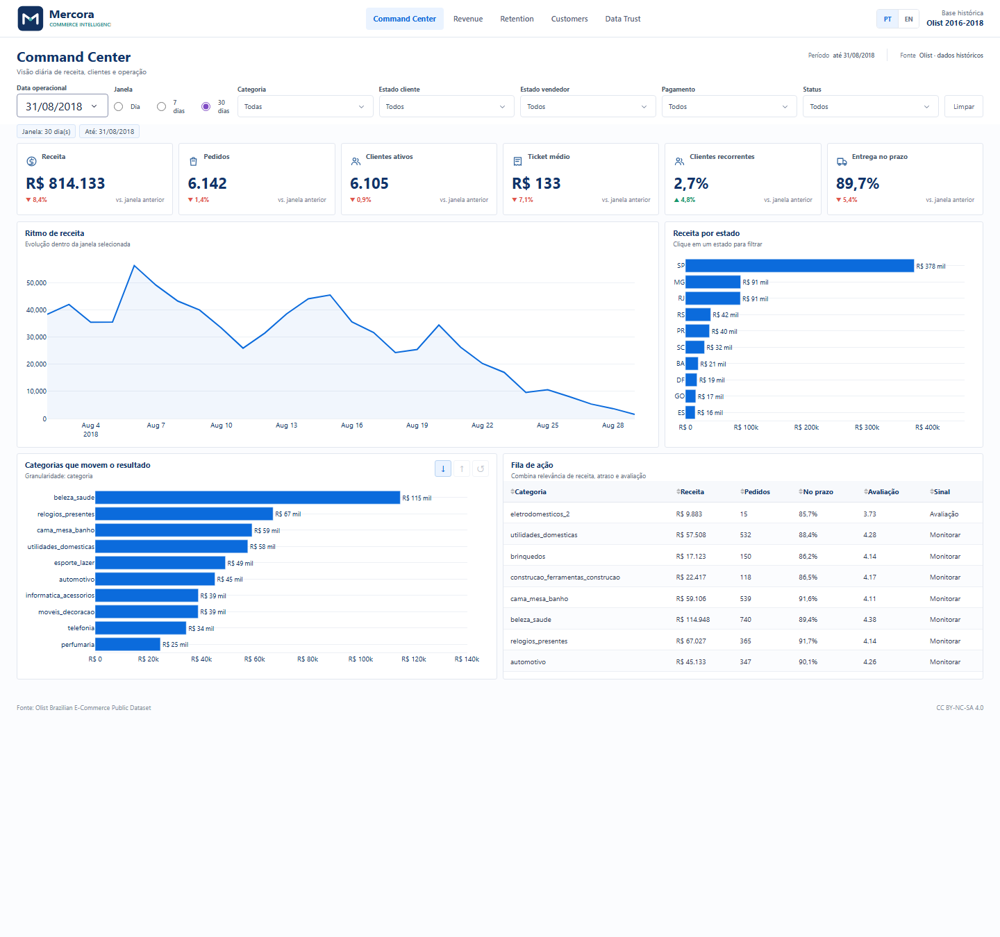
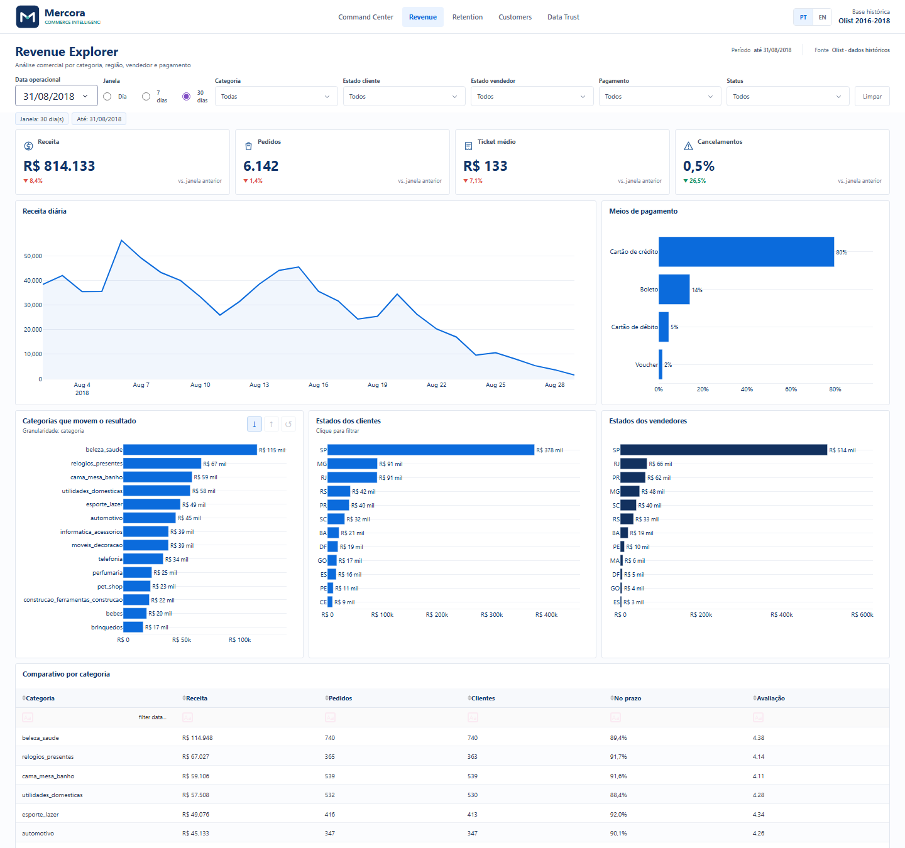
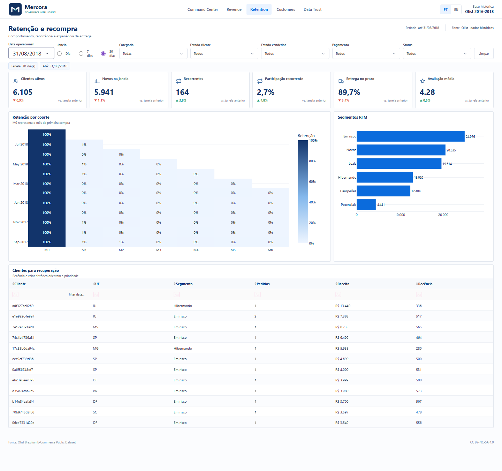
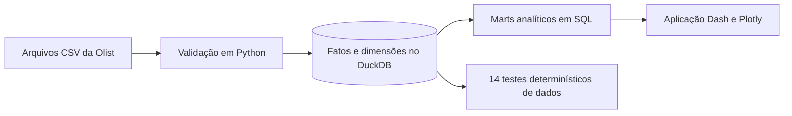

<p align="center">
  
</p>

<h1 align="center">Mercora Commerce Intelligence</h1>

<p align="center">
  Produto analítico para decisões de receita, retenção, entrega e confiança nos dados.
</p>

<p align="center">
  <a href="https://ba9ba428-78e2-4e6e-ac79-8a6dfe44fc99.plotly.app/?lang=pt"><strong>Abrir aplicação pública</strong></a>
  · <a href="README.md">English</a>
  · <a href="docs/DEMO_GUIDE.md">Roteiro de 90 segundos</a>
</p>



## O desafio de negócio

Líderes de comércio precisam descobrir **o que mudou, quem causou o desvio e onde agir**. Isso é difícil nos arquivos operacionais porque receita, pagamentos, entregas, avaliações e clientes possuem granularidades diferentes.

A Mercora transforma a base anonimizada da Olist em um produto diário que responde:

- Quais categorias, vendedores e regiões estão movendo a receita?
- Atrasos estão prejudicando a experiência do cliente?
- Quais grupos de clientes devem entrar na fila de recuperação?
- É possível confiar nos números e rastrear o cálculo de cada métrica?

## O que a análise encontrou

| Descoberta | Implicação para o negócio |
|---|---|
| Pedidos no prazo têm nota média **4,29**, contra **2,57** nos atrasados | Priorizar categorias de alta receita com piora na entrega antes de ampliar aquisição |
| Apenas **3,04%** dos clientes compraram mais de uma vez | Criar jornadas pós-compra entre 30 e 75 dias depois da entrega |
| São Paulo gerou **R$ 5,20 milhões** em receita histórica de itens | Comparar regiões por eficiência e experiência, não apenas por volume |
| Cinco categorias lideram o mix de receita | Monitorar entrega, avaliação e recompra dessas categorias separadamente |

Os resultados são reproduzidos a partir do snapshot e não estão escritos de forma fixa no dashboard. Consulte a [análise completa](docs/INSIGHTS.md).

## Fluxo de decisão

1. **Command Center** identifica desvios e prioridades.
2. **Revenue Explorer** encontra responsáveis por categoria, geografia, vendedor e pagamento.
3. **Retention** separa aquisição de recorrência usando coortes e RFM.
4. **Customer Explorer** chega ao detalhe anonimizado de cliente e pedido.
5. **Data Trust** apresenta origem, granularidade, reconciliação e definição das métricas.

<p align="center">
  
  
</p>

## Arquitetura e modelagem



Pedidos, itens e pagamentos permanecem em fatos separados. A receita de itens é agregada antes dos relacionamentos de um-para-muitos, impedindo que parcelas ou múltiplos itens multipliquem valores.

**Cobertura do snapshot:** 99.441 pedidos, 96.096 clientes anonimizados e 112.650 itens entre 2016 e 2018. A aplicação sempre identifica o período como histórico.

## Evidências de engenharia

- Pipeline reproduzível de download, construção, validação e execução.
- Modelo analítico no DuckDB e marts SQL com granularidade explícita.
- 14 controles de unicidade, integridade, reconciliação, datas e privacidade.
- 16 testes automatizados para métricas, filtros, drill-down, idiomas, empacotamento e inicialização.
- Interface em português e inglês com idioma persistente e links diretos.
- Marts publicados anonimizados; CSVs brutos e dados locais não entram no Git.

Consulte o [modelo de dados](docs/DATA_MODEL.md), [dicionário de métricas](docs/METRIC_DICTIONARY.md), [relatório de qualidade](docs/QA.md) e [guia de publicação](docs/DEPLOYMENT.md).

## Executar localmente

```powershell
git clone https://github.com/victorn198/mercora-commerce-intelligence.git
cd mercora-commerce-intelligence
python -m venv .venv
.venv\Scripts\pip install -r requirements.txt
copy .env.example .env
run.cmd -m pipeline validate
run.cmd app.py
```

Acesse `http://127.0.0.1:8050`. O repositório inclui o snapshot analítico anonimizado necessário para a demonstração.

## Dados e licença

A fonte analítica é o [Olist Brazilian E-Commerce Public Dataset](https://www.kaggle.com/datasets/olistbr/brazilian-ecommerce), licenciado sob CC BY-NC-SA 4.0. Este portfólio não comercial não possui vínculo com a Olist. O código usa licença MIT; os artefatos derivados continuam sujeitos à licença da fonte.
