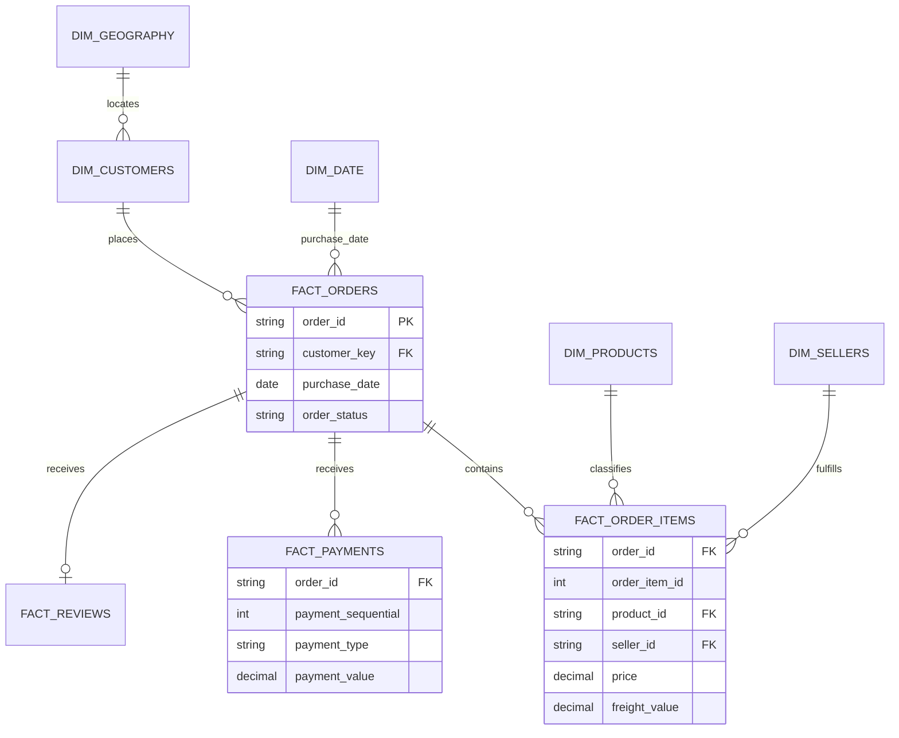

# Modelo de dados

## Regra central de granularidade

`fact_orders`, `fact_order_items` e `fact_payments` não são juntadas diretamente para somar receita. Itens e pagamentos são agregados por pedido antes da construção de `mart_orders`. Essa regra elimina o efeito de multiplicação causado por pedidos com vários itens e várias parcelas.

## Privacidade

O identificador original de cliente é transformado em um hash de 12 caracteres. Nomes, emails, telefones e endereços completos não existem na fonte publicada nem nos marts da aplicação.
